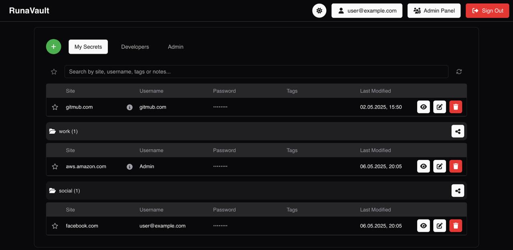
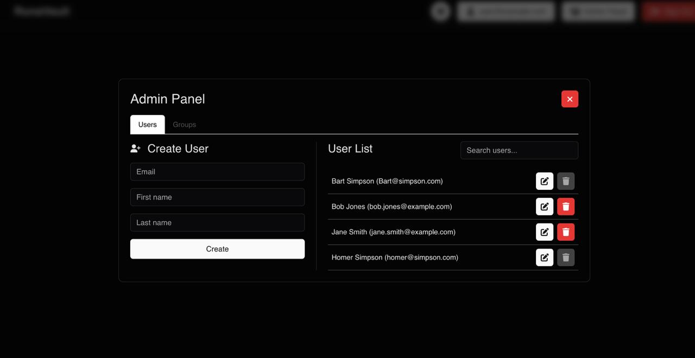
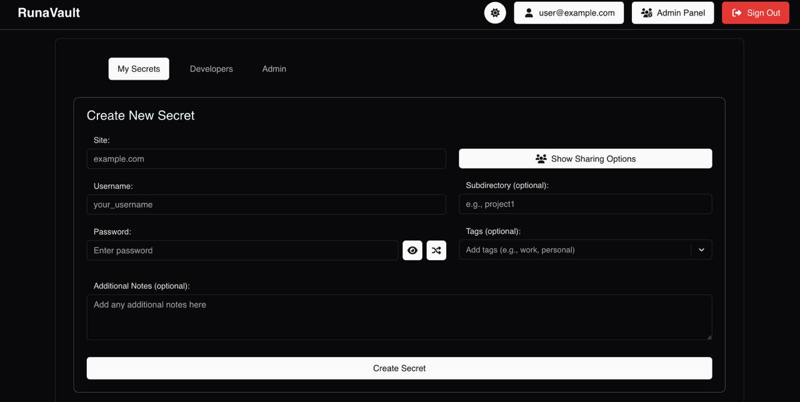
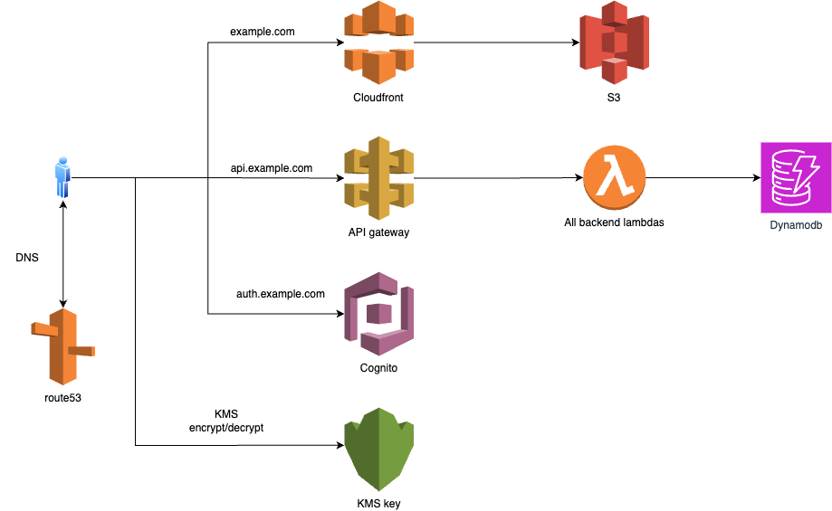

[](https://sonarcloud.io/summary/new_code?id=RunaVault_RunaVault)
[](https://sonarcloud.io/summary/new_code?id=RunaVault_RunaVault)
[](https://sonarcloud.io/summary/new_code?id=RunaVault_RunaVault)
[](https://sonarcloud.io/summary/new_code?id=RunaVault_RunaVault)
# RunaVault

RunaVault is a secure, serverless password management application built using AWS free-tier services and a React frontend. It enables users to create, manage, and share encrypted secrets (e.g., passwords) with individuals or groups, leveraging AWS Cognito for authentication, DynamoDB for storage, and KMS for encryption.

## Screenshots
<details>
<summary>Click to view screenshots</summary>







</details>

## Architecture



## Features

- **User Management**: Create and manage users and groups via an admin panel or Terraform. Note: The user must be added to Admin group to have access to Admin panel.
- **Multi-Factor Authentication**: All users are required to enable MFA by default for enhanced account security.
- **Secret Management**: Store, edit, and delete encrypted secrets with optional tags and subdirectories.
- **Sharing**: Share secrets with individual users or groups with role-based permissions (Viewer/Editor).
- **Encryption**: Passwords are encrypted client-side using AWS KMS keys.
- **Favorites**: Mark secrets as favorites for quick access.
- **Search & Filter**: Search secrets by site, username, notes, or tags; filter by favorites.
- **Responsive UI**: Built with React, FontAwesome icons, and react-select for a modern, user-friendly interface.
- **Dark and Light themes**: You can switch between dark and light themes. 

### Detailed Architecture

### Frontend
- **Framework**: React with hooks (`useState`, `useEffect`, `useCallback`) for state management.
- **Components**:
  - `AdminPanel`: Manage users and groups within RunaVault.
  - `CreateSecretForm`: Form to create new secrets with sharing options.
  - `SecretsTab`: Display and manage secrets with a directory structure.
  - `UserInfoTab`: Display user details and group memberships.
- **Styling**: Custom CSS (`App.css`) with Bootstrap-inspired classes.
- **Dependencies**: `react-select`, `react-oidc-context`, `@fortawesome/react-fontawesome`.

### Backend
- **Serverless**: Built using AWS Lambda Graviton2 for compute, deployed via Terraform.
- **Authentication**: AWS Cognito for user authentication and group management.
- **API**: AWS API Gateway for RESTful endpoints, secured with Cognito JWT tokens.
- **Storage**: AWS DynamoDB for storing encrypted secrets and metadata. With enabled [Point-in-time-recovery](https://aws.amazon.com/dynamodb/pitr/)
- **Encryption**: AWS KMS key for encrypting/decrypting passwords client-side.
- **CDN**: AWS CloudFront for serving the RunaVault frontend with low latency.

RunaVault's backend is designed to operate within AWS's free tier, making it cost-effective for small-scale deployments.

## Prerequisites

- **Node.js**: v22+ for frontend development.
- **AWS Account**: Access to free-tier services (Lambda, Cognito, API Gateway, CloudFront, DynamoDB, KMS, S3, ACM, Route 53).
- **Terraform**: For infrastructure deployment (or OpenTofu as an alternative).
- **S3 bucket**: For storing terraform state file. Recommended, but optional
- **AWS CLI**: Configured with credentials for deployment.

## Setup and Deployment

### Frontend and Backend
1. Clone the repository:
   ```bash
   $ git clone https://github.com/RunaVault/RunaVault.git
   $ cd RunaVault
   ```
2. Navigate to the Terraform directory:
   ```bash
   $ cd terraform/application
   ```
3. Edit `main.tf` with your values:
   - `domain_name`: Used to retrieve the hosted zone ID (e.g., `example.com`).
   - `frontend_domain`: Frontend domain for the RunaVault page (e.g., `vault.example.com`, or `example.com`).
   - `api_domain`: API Gateway domain for frontend-backend communication (e.g., `api.example.com`).
   - `cognito_domain`: Cognito domain for user authentication (e.g., `auth.example.com`).
   - `cognito_groups`: Pre-create Cognito groups; users in the `Admin` group can manage users and groups.
   - `cognito_users`: Create users and assign them to groups from `cognito_groups`.
   - `geo_restriction_type`: "whitelist" or "blacklist" countries. Optional
   - `geo_restriction_locations`: ISO 3166 country code, whitelist or blacklist countries. Optional

4. Initialize Terraform:
   ```bash
   $ terraform init
   ```
   or
   ```bash
   $ tofu init
   ```

5. Deploy the application:
   ```bash
   $ terraform apply
   ```
   or
   ```bash
   $ tofu apply
   ```

   - Confirm with `yes` when prompted.

## Usage

1. **Sign In**: Authenticate via Cognito using the RunaVault frontend.
2. **Admin Panel**: Accessible to admin users to manage users and groups.
3. **Create Secrets**: Use the "Create New Secret" form to add credentials.
4. **Manage Secrets**: View, edit, or delete secrets in the "Secrets" tab; share with users or groups.
5. **Directory Sharing**: Share entire subdirectories with specific permissions.

## Security Considerations

- Passwords are encrypted client-side using AWS KMS before being sent to the backend.
- Sharing uses role-based access control (Viewer/Editor) enforced by Cognito groups.
- Tokens (ID, Access, Refresh) are handled securely via `react-oidc-context` and validated at API Gateway and Lambda levels.
- Avoid sharing "Danger Area" information (e.g., tokens) displayed in the User Info tab.
- All users must enable Multi-Factor Authentication (MFA) as part of the Cognito signup flow, adding an extra layer of protection beyond username and password.


Below is the updated README section for your project's approximate costs, reflecting the AWS Free Tier changes effective July 15, 2025. The update accounts for the new 6-month credit-based Free Plan for new accounts, the unchanged always-free services, and the legacy 12-month Free Tier for accounts created before July 15, 2025. Costs are adjusted based on the provided example usage, and the structure mirrors your original format for consistency. All prices are in USD, based on the US East (N. Virginia) region as of July 2025, with a note to check current rates.


## Approximate Costs

RunaVault leverages AWS Free Tier services where possible. Below are approximate costs based on minimal usage, assuming you stay within the free tier initially and scale slightly beyond it. Costs are in USD, based on the US East (N. Virginia) region as of July 2025; check [AWS Pricing](https://aws.amazon.com/pricing/) for current rates.

For accounts created **on or after July 15, 2025**, the AWS Free Tier provides **$100 in credits** for 6 months (up to $200 with activity-based bonuses), covering usage across eligible services. Accounts created **before July 15, 2025** remain under the legacy 12-month Free Tier. Always-free services (e.g., Lambda, DynamoDB, S3) apply to both new and legacy accounts with monthly limits.

| **Service**       | **Free Tier (Always-Free or Credits)** | **Beyond Free Tier (Example Usage)**             | **Approx. Monthly Cost** |
|--------------------|---------------------------------------|--------------------------------------------------|--------------------------|
| **Lambda**        | 1M requests, 3.2M seconds (128 MB) always-free | 1.5M requests, 4M seconds: $0.30 + $0.80         | $1.10                   |
| **DynamoDB**      | 25 GB storage, 25 WCUs/RCUs always-free | 30 GB, 30 WCUs/RCUs: $1.25 + $0.14              | $1.39                   |
| **Cognito**       | 50,000 MAUs (6 months, credits)       | 100 MAUs: Free (within free tier)               | $0.00                   |
| **CloudFront**    | 1 TB data transfer, 10M requests always-free | 1.2 TB, 12M requests: $0.02 + $0.01             | $0.03                   |
| **S3**            | 5 GB storage, 20,000 GET, 2,000 PUT always-free | 10 GB, 25k GET, 3k PUT: $0.23 + $0.02 + $0.01   | $0.26                   |
| **ACM**           | Free for public certificates          | No additional cost                              | $0.00                   |
| **Route 53**      | $0.50 per hosted zone/month (credits, not always-free) | 1 hosted zone, 1M queries: $0.50 + $0.40    | $0.90                   |
| **API Gateway**   | 1M REST API calls (6 months, credits) | 1.5M calls: $1.75                               | $1.75                   |
| **KMS (Key Storage)** | 1 customer-managed key: $1.00 (credits) | 1 customer-managed key: $1.00                   | $1.00                   |
| **KMS (API Requests)** | 20,000 requests/month (credits)   | 25,000 requests: $0.15                          | $0.15                   |

- **Total Free Tier Cost**: $0.00/month (within always-free limits or 6-month credits for new accounts; 12 months for legacy accounts).
- **Total Beyond Free Tier**: ~$5.43/month (example usage above, after credits or always-free limits are exhausted).
- **Notes**:
  - For new accounts (post-July 15, 2025), usage is free until **$100-$200 in credits** are depleted or 6 months elapse (Free Plan). Upgrade to a Paid Plan for continued use or to access restricted services (e.g., AWS Marketplace).
  - Always-free services (Lambda, DynamoDB, S3, CloudFront) have monthly limits and apply to all accounts.
  - Costs scale with usage (e.g., more users, requests, or storage).
  - KMS costs are minimal (~$0.03 per 10,000 requests) and often negligible for small-scale use.
  - Route 53 assumes a custom domain; skip this cost if using default AWS domains.
  - Monitor usage via the AWS Billing and Cost Management Console or AWS Budgets to stay within credits or free limits.


## Contributing

1. Fork the repository.
2. Create a feature branch (`git checkout -b feature/your-feature`).
3. Commit changes (`git commit -m "Add your feature to RunaVault"`).
4. Push to the branch (`git push origin feature/your-feature`).
5. Open a Pull Request.

## License

RunaVault is licensed under the GNU GPL License - see the [LICENSE](LICENSE) file for details.

## Acknowledgments

- Thanks to AWS for providing free-tier services to enable RunaVault's serverless architecture.

## Support This Project

This project is open-source and maintained in my free time. If you find it useful, consider supporting its development:

- [Donate via GitHub Sponsors](https://github.com/sponsors/tokarev-artem)
- [Buy Me a Coffee](https://buymeacoffee.com/tokarevartem)
- [Paypal](https://www.paypal.me/ArtemiyTokarev)

Your support helps keep the project active and maintained. Thank you!
